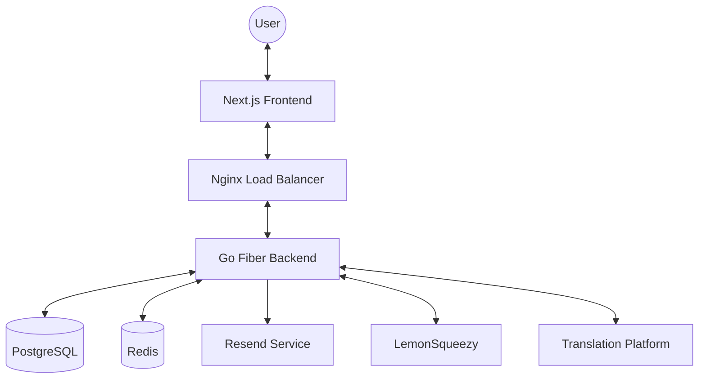

# Architecture Overview

GengoWatcher SaaS is built on a modern, distributed architecture designed for high availability, low latency job monitoring, and secure multi-tenant isolation.

## System Diagram

## Core Components

### 1. Frontend (Next.js 16)
The user interface is built with React 19 and Next.js, emphasizing speed and responsiveness.
- **App Router**: Optimized routing and server components.
- **Zustand**: Lightweight global state management.
- **TanStack Query**: Robust data fetching and synchronization.
- **Tailwind CSS**: Utility-first styling for a clean, professional UI.

### 2. Backend API (Go + Fiber)
A high-performance RESTful API built with Go and the Fiber framework.
- **Fiber 3.x**: Express-like syntax with Go's performance.
- **GORM 2.0**: Type-safe ORM for PostgreSQL interactions.
- **Watcher Manager**: A concurrent system that manages per-user job monitoring threads.

### 3. Real-Time Layer (Redis + WebSocket)
Handles instantaneous job alerts.
- **Redis Pub/Sub**: Acts as the message broker between background watcher threads and the WebSocket server.
- **WebSockets**: Provides a persistent connection to the user's browser for push notifications.

### 4. Data Layer (PostgreSQL)
The source of truth for all user data, configurations, and job history.
- **PostgreSQL 17**: Advanced relational database for structured data.
- **Row Level Awareness**: Every query is strictly filtered by `user_id` at the application level.

---

## Data Flow

### Job Discovery & Notification
1. **Watcher Instance**: A background Go routine polls an RSS feed or monitors a WebSocket for new jobs.
2. **Match Engine**: The new job is compared against the user's reward and language filters.
3. **Internal Event**: If a match is found, a message is published to Redis: `user:{id}:jobs`.
4. **WebSocket Push**: The API server's WebSocket handler receives the Redis message and pushes it to the user's active browser session.

### Authentication & Authorization
1. **Request**: User sends an API request with an `httpOnly` refresh token and a JWT access token.
2. **Middleware**: The backend validates the JWT signature and expiration.
3. **Context**: If valid, the `user_id` is injected into the request context.
4. **Handler**: The API handler uses the `user_id` from the context to filter database results.

---

## Scalability Design

### Horizontal Scaling
The Backend API is stateless, allowing it to be scaled horizontally across multiple containers or servers. Redis handles the cross-instance communication for WebSockets.

### High Availability
- **Database**: Recommended to run with a standby replica in production.
- **Cache**: Redis can be configured in Cluster mode for redundancy.
- **Compute**: Deployed on Kubernetes for automatic self-healing and scaling.

## Next Steps
- [Multi-Tenancy Details](../core-concepts/multi-tenancy.md)
- [Watcher System](../core-concepts/watcher-system.md)
- [API Reference](../api/overview.md)
