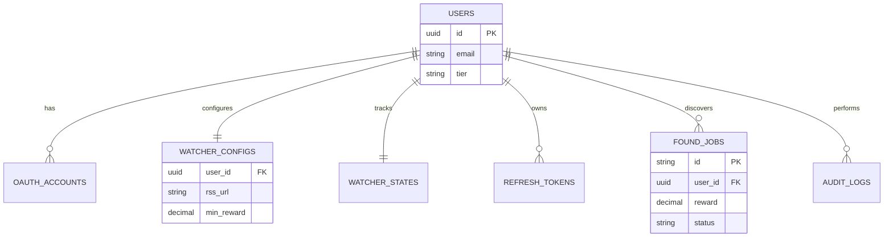

# Entity Relationships

GengoWatcher uses a relational model with strict referential integrity. All user data is tied back to a central `users` table.

## Entity Relationship Diagram (ERD)

---

## Relationship Details

### One-to-One Relationships
- **`users` ↔ `watcher_configs`**: A user has exactly one monitoring configuration.
- **`users` ↔ `watcher_states`**: A user has exactly one runtime state for their watcher.

### One-to-Many Relationships
- **`users` → `oauth_accounts`**: A user can link both Google and GitHub accounts.
- **`users` → `refresh_tokens`**: A user can have multiple active sessions on different devices.
- **`users` → `found_jobs`**: Over time, a user will discover many jobs.
- **`users` → `audit_logs`**: Each action taken by a user is logged.

---

## Referential Integrity

We use **Foreign Key Constraints** with the following policies:
- **`ON DELETE CASCADE`**: If a user is deleted, all their configs, states, tokens, and jobs are automatically removed. This ensures we don't store orphaned data and complies with "Right to be Forgotten" privacy laws.

---

## Indexing Strategy

To support these relationships and ensure fast queries:
1. Every foreign key column is indexed.
2. Unique indexes are placed on `email` and `oauth_accounts(provider, provider_user_id)`.
3. Multi-column indexes are used for job filtering (e.g., `user_id, status, found_at`).

## Next Steps
- [Schema Reference](../database/schema-reference.md)
- [Performance Optimization](../database/performance-optimization.md)
